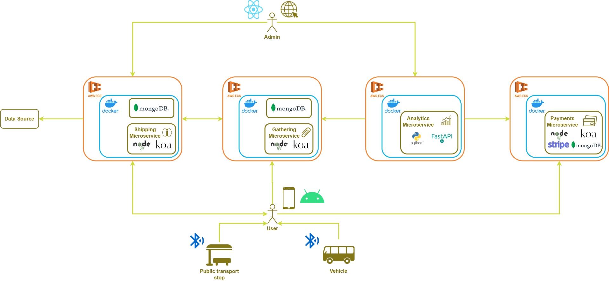

Balit consiste en un proyecto software orientado a dar soporte sobre la información que se ofrece en el transporte público, así como el seguimiento del mismo en los trayectos.

Uno de los principales objetivos de este proyecto es la accesibilidad. Pretendemos que nuestra aplicación sea usable para cualquier tipo de usuario que se lo proponga o que incluso, necesite de una herramienta para poder utilizar el transporte público.

En este repositorio se encuentra lo relacionado puramente con el desarrollo del back-end y el despliegue. En la arquitectura de la propuesta de este sistema, decidimos utilizar microservicios y por el momento, hemos desarrollado lo relacionado con el Shipping Microservice cuyo principal cometido es servir la información de las líneas, paradas y puntos de interés.

Este proyecto se complementa con su correspondiente aplicación de Android, la cual puedes observar [aquí](https://github.com/fer227/Balit-Android).